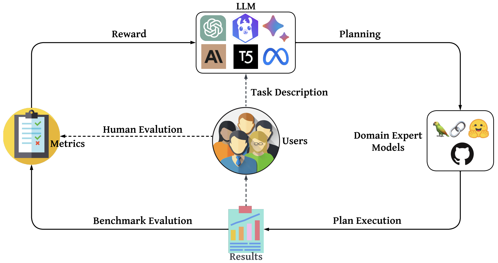

# OpenAGI: When LLM Meets Domain Experts

"May the Force be with LLM and Domain Experts." -- Generated by ChatGPT.

<a href='https://arxiv.org/abs/2304.04370'></a> 
[](https://github.com/agiresearch/OpenAGI/blob/main/LICENSE)

## OpenAGI Framework
<p align="center">

</p>

## News

-**[2024.2.2]** We developed methods to control the behavior of LLM Agents based on formal language, more details are available on [this repository](https://github.com/agiresearch/Formal-LLM) and the functionality is being integrated to this main repository too.

-**[2023.8.30]** OpenAGI now supports Llama-2, Claude-2, and GPT-4 as the backbone LLM, plus the already supported GPT-3.5, Vicuna, and Flan-T5 backbone LLMs.

-**[2023.5.25]** A demo video of using the OpenAGI platform is added.

-**[2023.5.11]** We release the restructured code of OpenAGI, including the support of both benchmark tasks for quantitative AGI evaluation and open tasks that utilize tools from LangChain, as well as a command line UI that supports easy interaction with OpenAGI when solving complex open tasks.

-**[2023.4.10]** We release the initial version of OpenAGI, including the source code, benchmark, and evaluation methods.

## Introduction
Human intelligence has the remarkable ability to assemble basic skills into complex ones so as to solve complex tasks. This ability is equally important for Artificial Intelligence (AI), and thus, we assert that in addition to the development of large, comprehensive intelligent models, it is equally crucial to equip such models with the capability to harness various domain-specific expert models for complex task-solving in the pursuit of Artificial General Intelligence (AGI). Recent developments in Large Language Models (LLMs) have demonstrated remarkable learning and reasoning abilities, making them promising as a controller to select, synthesize, and execute external models to solve complex tasks. 

This project presents OpenAGI, an open-source AGI research platform, specifically designed to offer complex, multi-step tasks and accompanied by task-specific datasets, evaluation metrics, and a diverse range of extensible models. OpenAGI formulates complex tasks as natural language queries, serving as input to the LLM. The LLM subsequently selects, synthesizes, and executes models provided by OpenAGI to address the task. Furthermore, the project presents the Reinforcement Learning from Task Feedback (RLTF) mechanism, which uses the task-solving result as feedback to improve the LLM's task-solving ability. Thus, the LLM is responsible for synthesizing various external models for solving complex tasks, while RLTF provides feedback to improve its task-solving ability, enabling a feedback loop for self-improving AI. We believe that the paradigm of LLMs operating various expert models for complex task-solving is a promising approach towards AGI. 

To facilitate the community's long-term improvement and evaluation of AGI's ability, we open-source the code, benchmark, and evaluation methods of the OpenAGI project, and we appreciate any discussions, comments, suggestions or contributions from the community.

>An introductory video is available at [here](https://youtu.be/7RaXPPXi0-Y), thanks and credits to @intheworldofai.

### Benchmark Task Examples
<p align="center">

</p>

### Open Task Examples
1. Instruct OpenAGI to create a traditional Chinese painting using "Gao Shan Liu Shui" (High Mountain and Flowing Water, 高山流水) as the theme, accompanied by a piece of generated ancient Chinese poem and a piece of music that are consistent with the painting. OpenAGI first searched online to "understand" the ancient story of "Gao Shan Liu Shui", and then generated the painting, poem and music step by step based on the collaboration between large language models and domain expert models. The created painting, poem and music are consistent with the ancient story.

<p align="center">

</p>

2. Instruct OpenAGI to create a travel report for a trip to China, including recommendations for sights, activities, and local cuisine, as well as practical information for travelers, such as how to stay safe and healthy and how to navigate the country.

<p align="center">

</p>

### A Demo of using the OpenAGI Platform
https://github.com/agiresearch/OpenAGI/assets/23147604/032646fe-ad50-4494-a52e-1a9594724db4


## Requirements
- Python 3.9.16
- PyTorch 1.12.1
- transformers==4.28.0
- langchain==0.0.153


## Usage

0. Clone this repo and create a conda virtual environment

    ```
    # create a conda virtual environment
    conda create --name openagi python=3.9
    # actiavte openagi conda environment
    conda activate openagi
    #install torch
    pip3 install torch torchvision torchaudio
    # clone github repo
    git clone https://github.com/agiresearch/OpenAGI.git
    # change directory into project directory
    cd OpenAGI/
    # install required packages
    pip install -r requirements.txt
    ```

1. Download the preprocessed data from this [Google Drive link](https://drive.google.com/drive/folders/1AjT6y7qLIMxcmHhUBG5IE1_5SnCPR57e?usp=share_link), put it into the *OpenAGI/benchmark_tasks/* folder, then unzip it. If you would like to preprocess your own data, please run data_augmentation.py in the *data* folder. Raw data will be automatically downloaded using Hugging Face datasets library; for COCO, please download from [COCO](https://cocodataset.org/#download).

    ```
    wget http://images.cocodataset.org/zips/val2017.zip
    ```


<p align="center">

</p>


2. To get a teaser of OpenAGI platform, please start by entering the necessary content in the *run_openagi.sh* file.


3. To evaluate Zero-shot or few-show shemas, please change TASK="zero_shot" or TASK="few_shot"   
    ```
    bash run_openagi.sh
    ```
   
4. To evaluate finetuned Flan-T5-Large, please first download the pretrained checkpoints from this [Google Drive link](https://drive.google.com/drive/folders/1AjT6y7qLIMxcmHhUBG5IE1_5SnCPR57e?usp=share_link) into *benchmark_tasks/finetune/* folder, then excute *run_openagi.sh* with TASK="finetune" and LLM_NAME="flan_t5". 
    ```
    bash run_openagi.sh
    ```
    
    Or pretrain with scripts provided in *benchmark_tasks/finetune/* folder to get your own checkpoint, such as

    ```
    python benchmark_tasks/finetune/flan_t5_finetune.py
    ```
 
 5. To evaluate RLTF-based Flan-T5-Large, please first download the pretrained checkpoints from this [Google Drive link](https://drive.google.com/drive/folders/1AjT6y7qLIMxcmHhUBG5IE1_5SnCPR57e?usp=share_link) into *benchmark_tasks/finetune/* folder, then
    ```
    bash run_openagi.sh
    ```
    
## License
1. The source code of OpenAGI is licensed under Apache 2.0. The intended purpose is solely for research use.

2. The datasets are licensed under CC BY NC 4.0, which permits only non-commercial usage. See the CC-BY-NC-SA-4.0.txt file for details. For the datasets in this benchmark, you should follow their license. It is advised that any models trained using the dataset should not be utilized for anything other than research purposes.

3. The source code of Restormer is under its original ACADEMIC PUBLIC LICENSE, see Restormer License.md file for details.

4. The source code of Colorization is under its original BSD-2-Clause license, see Colorization License.md file for details.

## Citation

```
@article{openagi,
  title={OpenAGI: When LLM Meets Domain Experts},
  author={Ge, Yingqiang and Hua, Wenyue and Mei, Kai and Ji, Jianchao and Tan, Juntao and Xu, Shuyuan and Li, Zelong and Zhang, Yongfeng},
  journal={In Advances in Neural Information Processing Systems (NeurIPS)},
  year={2023}
}
```

